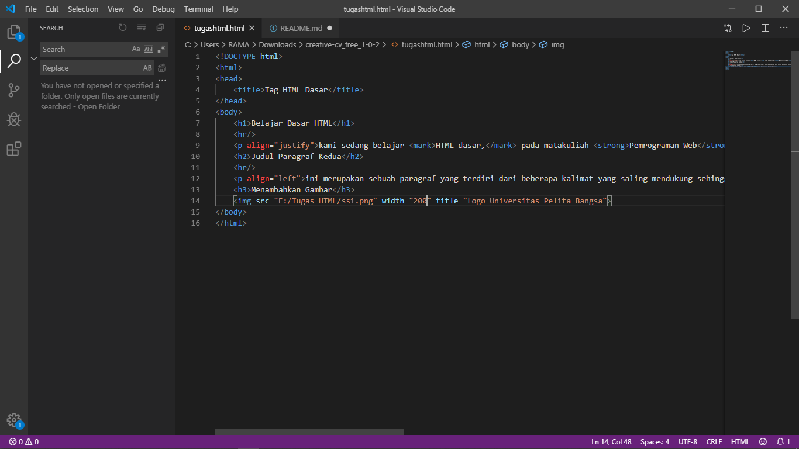
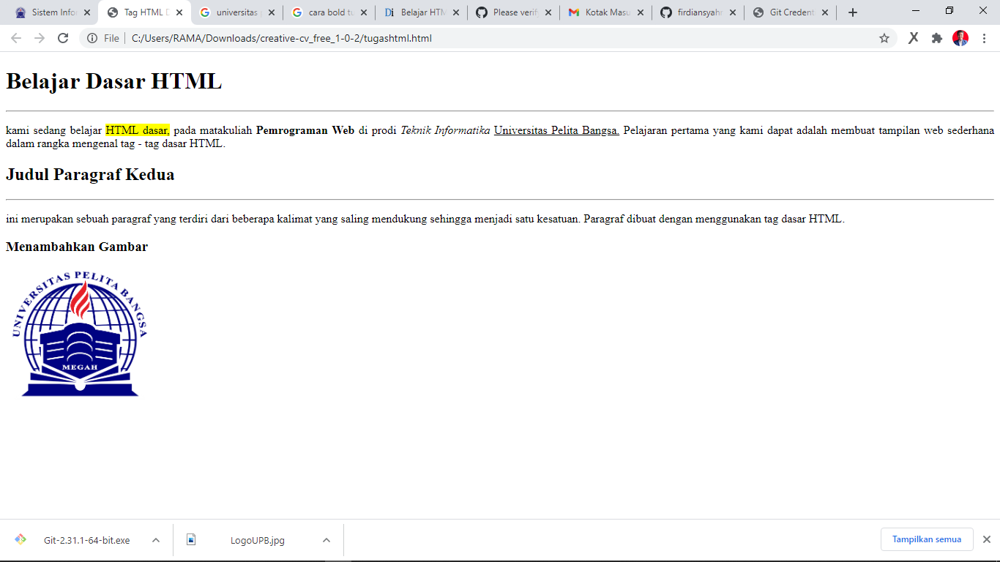

# tugass1
# Tugas1
## tugas_praker
## Belajar Tag Dasar HTML
DOCTYPE merupakan suatu deklarasi memberitahukan kepada browser jenis dan versi HTML yang telah di gunakan pada bariskode diatas kita menggunakan jenis dan versi untuk HTML 5 yang saat ini sudah terbilang moderen.

HEAD biasa digunakan untuk menemukan informasi pada suatu dokumen html.baris tersebut merupakan baris yang penting dan harus ada di setiap web

TITLE biasa di gunakan pada baris judul di setiap halaman dan baris tersebut sangat penting di gunakan dalam membuat web

BODY baris yang berisi konten pada web , seperti Heading,Div,image,Footer dan sebagainya
### ini adalah hasil praktek saya

